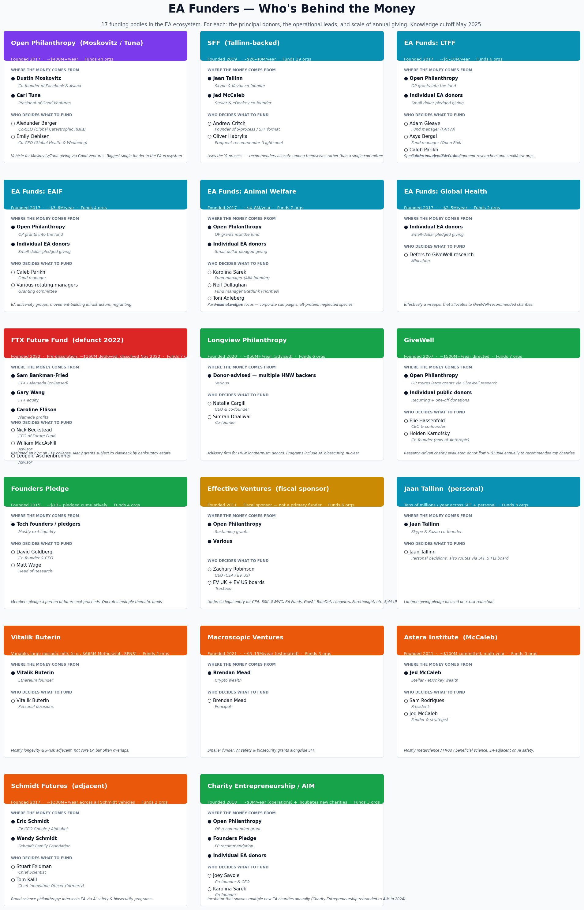
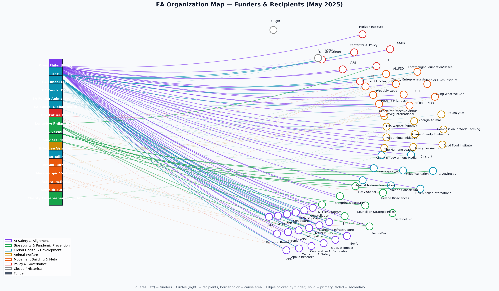

# EA Organization Map

An interactive map of Effective Altruism organizations and their funding relationships, as of May 2025. Includes the **people behind each funder** — principal donors, fund managers, and operational leads.

## The 17 funders, at a glance



See [FUNDERS.md](FUNDERS.md) for the full reference doc with every donor, lead, founding year, scale, and source link.

## Full network — funders → recipients



**Live site:** _Enable GitHub Pages (Settings → Pages → main branch / root) to get a URL like `https://<username>.github.io/ea-organization-map/`._

## What's in here

| File | Format | Description |
|---|---|---|
| `index.html` | Interactive HTML | Click any funder for the people behind it. Filter by funder or cause area. Loads vis-network from CDN. |
| `FUNDERS.md` | Markdown | Full reference doc: donors, leads, founded year, scale, source links per funder. |
| `funders_preview.png` | PNG | The 17 funder cards (above). |
| `preview.png` | PNG | The full funder→recipient network overview. |
| `EA_funding_map.canvas` | Obsidian Canvas | Drop into an Obsidian vault and open as a visual canvas. |
| `EA_funding_mindmap.mermaid` | Mermaid | Radial mindmap — funders → cause areas → orgs. |
| `EA_funding_graph.mermaid` | Mermaid | Cross-funding flowchart with multiple funders per recipient. |
| `EA_AI_safety_deepdive.mermaid` | Mermaid | AI safety subset with founders, dates, and org genealogy. |
| `funders_detail.py` | Python | Source of truth for funder people data. |
| `build_canvas.py` | Python | Source of truth for nodes & edges. |
| `build_html.py` / `build_preview.py` / `build_funders_preview.py` / `build_funders_md.py` | Python | Regeneration scripts. |

To regenerate everything after edits to `build_canvas.py` or `funders_detail.py`:

```bash
python3 build_canvas.py
python3 build_html.py
python3 build_preview.py
python3 build_funders_preview.py
python3 build_funders_md.py
```

## Scope

- **Funders** (17): Open Philanthropy (Moskovitz/Tuna), SFF (Tallinn), EA Funds (LTFF, EAIF, AWF, GHDF), FTX Future Fund (defunct), Longview Philanthropy (Cargill/Dhaliwal), GiveWell (Hassenfeld/Karnofsky), Founders Pledge (Goldberg), Effective Ventures (sponsor), Jaan Tallinn personal, Vitalik Buterin, Macroscopic Ventures (Mead), Astera Institute (McCaleb), Schmidt Futures (Schmidts), Charity Entrepreneurship/AIM (Savoie/Sarek).
- **Recipients** (~60): grouped into AI Safety & Alignment, Biosecurity & Pandemic Prevention, Global Health & Development, Animal Welfare, Movement Building & Meta, Policy & Governance, and Closed / Historical.
- **Edges** (125): primary funding relationships (solid) and secondary / smaller grants (dashed).

## Caveats

- Cross-funding is the norm — most major recipients (MIRI, Lightcone, CEA, Rethink Priorities, FLI, GovAI, ALLFED) receive money from several sources. Edges represent publicly known or widely reported flows; private grants are not captured.
- Funding scale estimates are rough; pulled from publicly disclosed grants databases (Open Philanthropy grants page, GiveWell metrics, EA Forum posts).
- FTX Future Fund grants are historical — the entity dissolved in November 2022 and many grants were subject to bankruptcy clawback.
- FHI Oxford closed April 2024 and is shown under Closed / Historical.
- Schmidt Futures, Astera, and Collison-funded orgs are **EA-adjacent** rather than core EA.
- Anthropic is a for-profit AI lab; it appears because Open Phil made a foundational investment and Alameda invested ~$500M (later sold by the bankruptcy estate). It is not an EA org per se.

## License

CC BY 4.0 — free to share and adapt with attribution.
